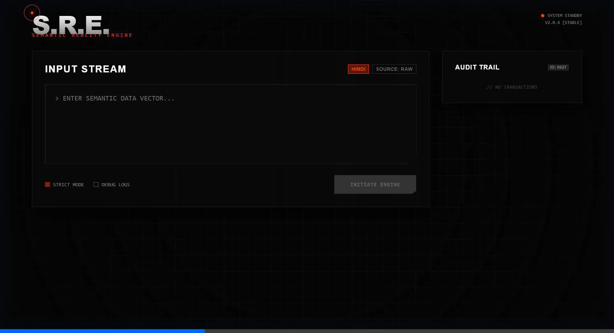
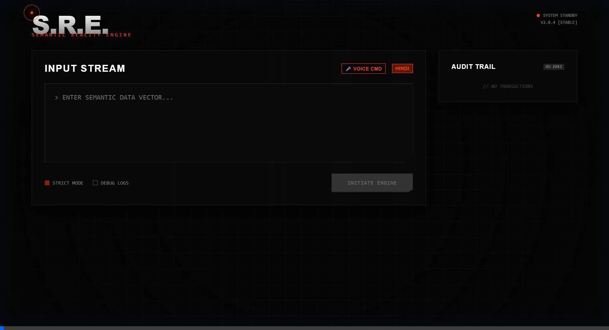

# S.R.E. - Semantic Reality Engine



> **"Reality is just a semantic vector waiting to be parsed."**

The **Semantic Reality Engine (S.R.E.)** is a high-fidelity frontend simulation of a domain-critical intelligence system. It demonstrates advanced React.js capabilities, Glassmorphism UI design, and interactive simulations of voice-activated compliance logic.

---

## 🚀 Live Demo

**[View Live Deployment](https://semantic-reality-engine.vercel.app)**
---

## ✨ Key Features

### 🖥️ "Atlas Digital" Aesthetic
*   **Deep Void Black** theme with a subtle grid foundation.
*   **Vibrant Orange-Red** accents for high-contrast visibility.
*   **Glassmorphism 2.0**: Blocky, crystal-like panels with dynamic borders.

### 🎙️ Voice Command ("Jarvis Mode")
*   Activate the **Microphone** to simulate voice input.
*   Visual **Audio Wave** animations synced to state.
*   **Simulated Tuition**: Realistic character-by-character typing effect for Hindi input.



### ⚡ Auto-Inject & Tools
*   **Quick Inject (⚡)**: Instantly load complex test cases (Legal, Medical, Admin).
*   **Semantic Analysis**: Simulates the extraction of actors, obligations, and risk levels from raw text.
*   **Audit Trail**: detailed history of all semantic vectors processed.

### 🧠 Domain Logic Simulation
The engine currently supports mock processing for:
1.  **Legal**: Checks for notice periods and termination clauses.
2.  **Medical**: Flags dosage instructions and critical compliance.
3.  **Administrative**: Tracks file approvals and deadlines.

---

## 🛠️ Tech Stack

*   **Core**: React 18, Vite
*   **language**: JavaScript (ES6+)
*   **Styling**: Vanilla CSS3 (Custom Variables, CSS Grid, Keyframe Animations)
*   **Design**: Glassmorphism, Brutalism

---

## 📦 Installation

Clone the repository and install dependencies:

```bash
git clone https://github.com/antima121-bit/SEMANTIC-REALITY-ENGINE.git
cd SEMANTIC-REALITY-ENGINE
npm install
```

### Run Locally

Start the development server:

```bash
npm run dev
```

Visit `http://localhost:5173`.

---

## 👨‍💻 Developer Uplink

**Antima Mishra**
*   🔗 **LinkedIn**: [antima-mishra-6483ba252](https://www.linkedin.com/in/antima-mishra-6483ba252/)
*   💻 **GitHub**: [antima121-bit](https://github.com/antima121-bit)
*   📧 **Email**: antimamishra113@gmail.com

---

